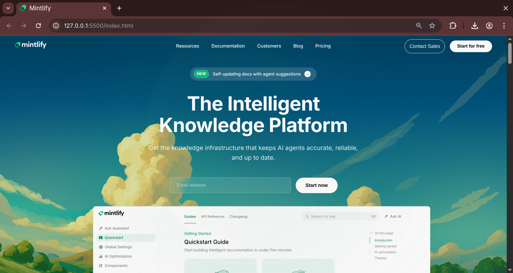
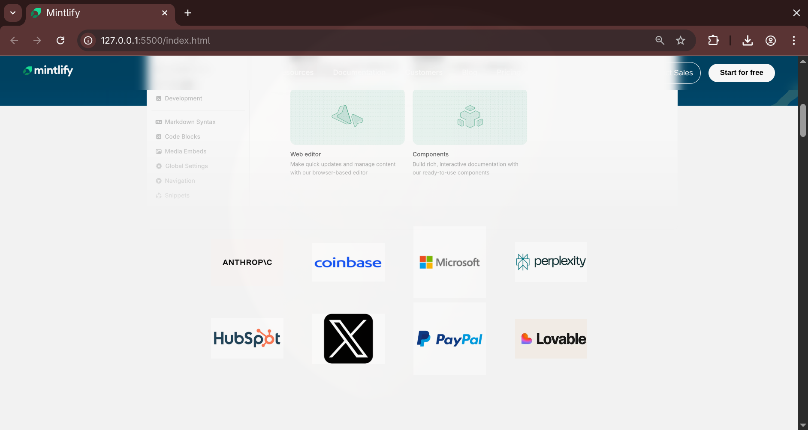
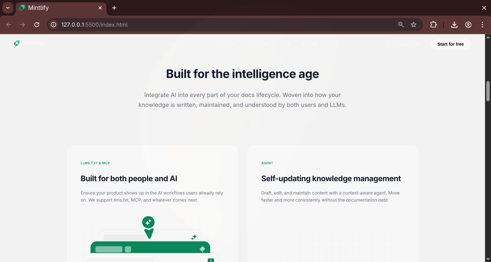
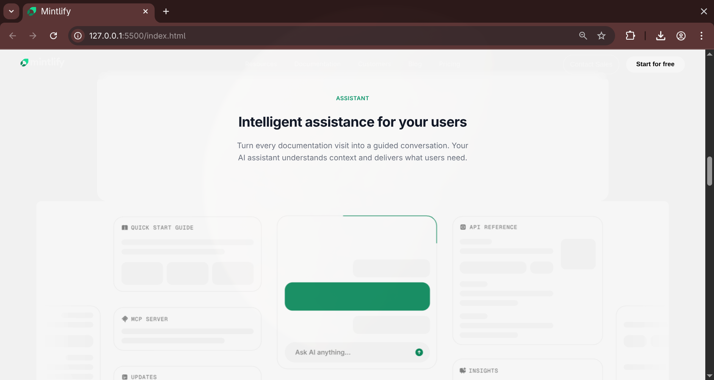
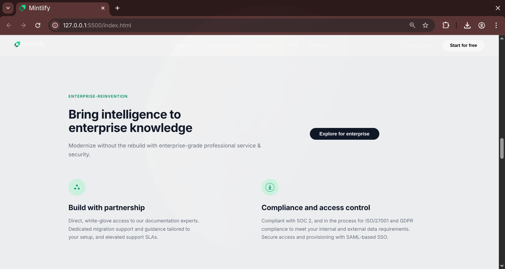
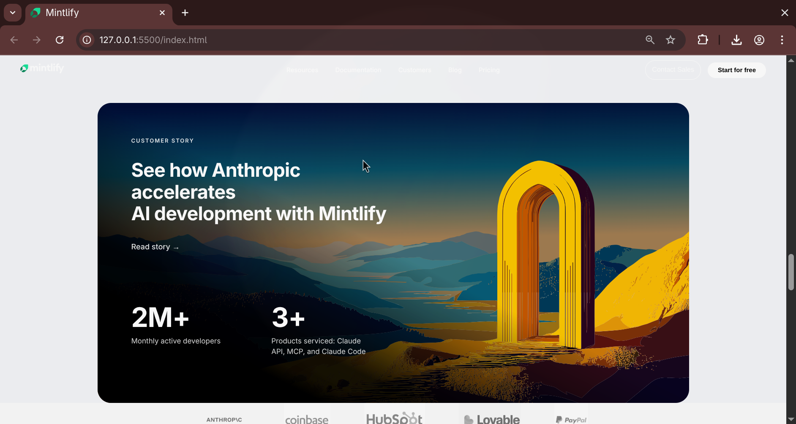
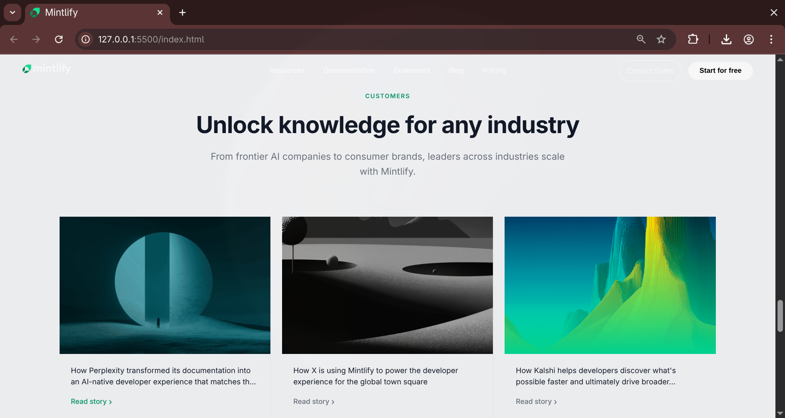
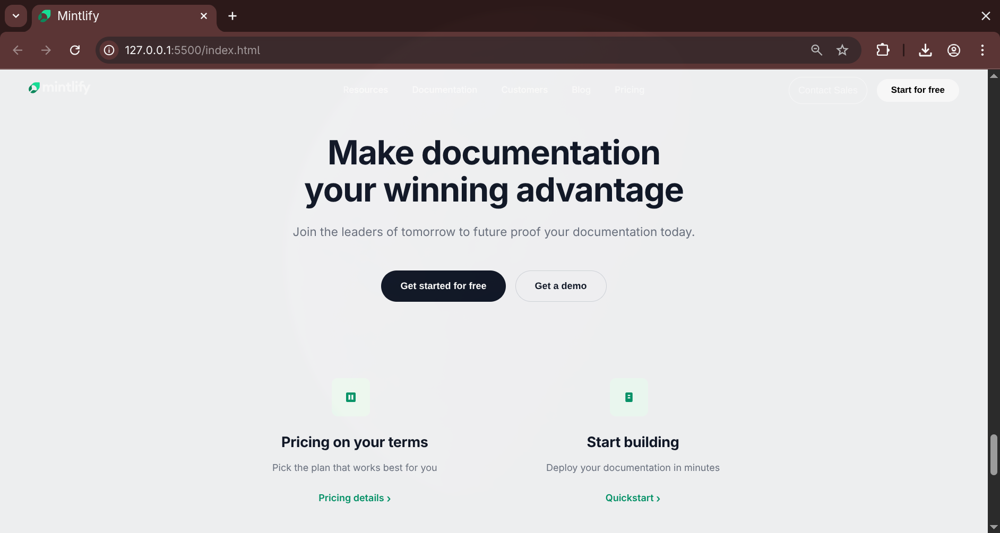
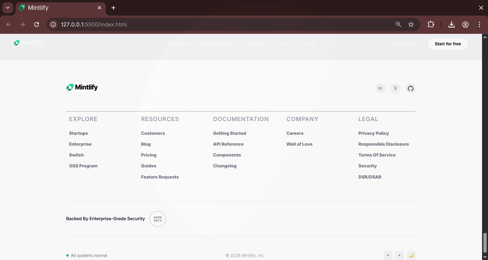

# Mintlify Clone - Web Dev Cohort Assignment

A recreation of the Mintlify landing page built with HTML and CSS only, following the Web Dev Cohort constraints.

## Live Demo

🔗 **[View Live Website](#)** 

---

## Project Overview

This project is a pixel-perfect recreation of the Mintlify landing page. It was built as part of a Web Development Cohort assignment with specific constraints: HTML and CSS only, no JavaScript, no animations, and no external CSS frameworks.

---

## Sections Recreated

✅ **1. Top Navigation Bar**
- Logo/wordmark
- Navigation links (Resources, Documentation, Customers, Blog, Pricing)
- Primary and secondary CTA buttons (Contact Sales, Start for free)

✅ **2. Hero Section**
- "NEW" badge with feature announcement
- Main headline: "The Intelligent Knowledge Platform"
- Descriptive text
- Email input with CTA button
- Large hero illustration

✅ **3. Trusted By / Logos Section**
- Two rows of company logos (Anthropic, Coinbase, Microsoft, Perplexity, HubSpot, X, PayPal, Lovable)
- Clean grid layout

✅ **4. Intelligence Section**
- Section heading and description
- Intro text for feature highlights

✅ **5. Feature Cards**
- Two main feature cards (LLMS.TXT & MCP, AGENT)
- Card headers with badges
- Descriptive text and images
- Clean grid layout

✅ **6. Assistant Section**
- "ASSISTANT" badge
- Title and description
- Large UI mockup image

✅ **7. Enterprise Features Section**
- "ENTERPRISE-REINVENTION" badge
- Main heading with description
- "Explore for enterprise" CTA button
- Two feature blocks with icons:
  - Build with partnership
  - Compliance and access control
- SVG icons for visual appeal

✅ **8. Customer Story Section**
- Full-width card with Anthropic background
- Story badge and heading
- Statistics display (2M+ monthly developers, 3+ products)
- "Read story" link

✅ **9. Customer Cards Section**
- Three customer cards (Perplexity, Vercel/X, Kalshi)
- Card images with overlay content
- Company descriptions
- "Read story" links
- Navigation arrows (previous/next)

✅ **10. Final Call-To-Action Section**
- Strong headline: "Make documentation your winning advantage"
- Subtitle text
- Two CTA buttons (Get started for free, Get a demo)
- Two informational cards:
  - Pricing on your terms
  - Start building
- SVG icons for each card

✅ **11. Footer**
- Mintlify logo
- Social media links (LinkedIn, X/Twitter, GitHub)
- Multi-column link sections:
  - EXPLORE (Startups, Enterprise, Switch, OSS Program)
  - RESOURCES (Customers, Blog, Pricing, Guides, Feature Requests)
  - DOCUMENTATION (Getting Started, API Reference, Components, Changelog)
  - COMPANY (Careers, Wall of Love)
  - LEGAL (Privacy Policy, Terms Of Service, Security, etc.)
- Security badge (SOC 2 Certified)
- Status indicator and copyright
- Theme toggle buttons

---

## Design Details

### Fonts Used
- **Primary Font:** Inter (Google Fonts)
- Weights: 300, 400, 500, 600, 700, 800
- Used for all body text, headings, and buttons

### Colors Used
- **Primary Green:** `#059669` - Used for buttons, highlights, icons, and accents
- **Primary Text:** `#000000` / `#111827` - Dark text for readability
- **Background Light:** `#FFFFFF` - Main background
- **Background Light Tint:** `#f3f4f6`, `#f9fafb` - Section backgrounds
- **Gray Accents:** Various shades for borders and secondary text
- **Card Background:** `#d1fae5` - Light green for icon backgrounds

### Layout Approach
- Desktop-only layout (1200px+ recommended viewport)
- No responsive breakpoints
- Fixed-width container design
- Flexbox for component layouts
- CSS Grid for multi-column sections

### Assets
All images and icons are organized in the `/assets` folder:
- SVGs for logos and illustrations
- WebP format for optimized images
- PNG fallbacks where needed
- Favicon: Mintlify wordmark SVG

---

## Project Structure

```
mintifly clone/
├── index.html          # Main HTML file
├── index.css           # All styling
├── assets/             # Images, logos, and icons
│   ├── mintlify-wordmark.svg
│   ├── hero-image-light.svg
│   ├── anthropic.webp
│   ├── coinbase.webp
│   ├── microsoft.webp
│   ├── perplexity.webp
│   ├── hubspot.webp
│   ├── x.webp
│   ├── paypal.png
│   ├── lovable.webp
│   ├── card1.jpeg
│   ├── card2.jpeg
│   ├── card3.png
│   ├── perplexity.png
│   ├── vercel.png
│   ├── kalshi.png
│   ├── anthropic.svg
│   └── Mintlify_idjQU-FEBd_0.png
└── README.md           # This file
```

---

## Technical Specifications

- **HTML:** Semantic HTML5 structure
- **CSS:** Pure CSS (no preprocessors)
- **Images:** Optimized WebP and PNG formats
- **Fonts:** Google Fonts (Inter)
- **Browser Support:** Modern browsers (Chrome, Firefox, Safari, Edge)
- **File Size:** Optimized for performance
- **Accessibility:** Semantic HTML elements

---

## Screenshots



















---

## How to Use

1. Clone or download this repository
2. Open `index.html` in your web browser
3. No build process or dependencies required
4. All assets are included in the `/assets` folder

---

## Constraints Followed

✅ **Only HTML and CSS** - No JavaScript used  
✅ **No TailwindCSS** - Pure CSS styling  
✅ **No AI Generated Code** - Manually written HTML and CSS  
✅ **No Animations** - Static design only  
✅ **No Responsiveness** - Desktop-only layout  
✅ **Original Assets** - Images sourced from or similar to official website  
✅ **Design Fidelity** - Matches fonts, colors, and layout of original  

---

## Assignment Details

**Course:** Web Development Cohort  
**Project Type:** Landing Page Recreation  

---

## Resources & References

- [Mintlify Official Website](https://mintlify.com)
- [Google Fonts - Inter](https://fonts.google.com/specimen/Inter)
- [MDN Web Docs](https://developer.mozilla.org)

---

## License

This project is a recreation for educational purposes as part of a cohort assignment. Please refer to the original Mintlify website for official information.

---

**Note:** This is a clone created for learning purposes. For the official Mintlify platform and documentation, visit [mintlify.com](https://mintlify.com)
